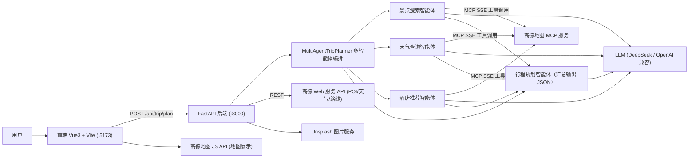

<div align="center">

# 🧳 智能旅行助手

**基于 LangChain 多智能体 + 高德地图 MCP 的 AI 旅行规划应用**

输入目的地和日期，多个智能体自动协作完成景点搜索、天气查询、酒店推荐与行程规划，生成一份带地图、预算与每日安排的完整旅行计划。


</div>

---

## 📖 项目简介

智能旅行助手是一个前后端分离的 AI 旅行规划应用：

- **后端**基于 FastAPI 构建，核心是一个 LangChain 多智能体系统。景点搜索、天气查询、酒店推荐三个智能体通过 `MultiServerMCPClient` 连接高德地图 MCP 服务（SSE）动态加载地图工具，并**异步并发执行**；行程规划智能体汇总所有信息，由 LLM（DeepSeek 等 OpenAI 兼容接口）生成结构化的 JSON 旅行计划。
- **前端**基于 Vue 3 + Ant Design Vue 构建，提供行程表单、行程卡片、每日安排、预算明细、天气卡片，并通过高德地图 JS API 在地图上标注景点分布，支持行程编辑与导出图片/PDF。

## ✨ 功能特性

- 🤖 **多智能体协作**：景点搜索 / 天气查询 / 酒店推荐三个智能体基于 MCP 工具异步并发执行，行程规划智能体汇总生成最终计划
- 🗺️ **高德地图 MCP**：通过 `MultiServerMCPClient`（SSE）动态加载高德 POI 搜索、天气、路线规划等工具
- 🌤️ **真实数据驱动**：天气预报、POI 详情、路线规划全部来自高德开放平台真实接口，内置 QPS 限流与指数退避重试
- 📋 **结构化行程输出**：每日 2-3 个景点 + 三餐推荐 + 酒店推荐，LLM 结构化输出经 Pydantic 严格校验，失败自动重试并降级为文本解析；兜底示例行程会在页面明确标注
- 📍 **坐标真实性校验**：行程生成后自动用高德 POI 搜索回填景点真实经纬度，避免 LLM 编造坐标导致地图标点偏移
- 💾 **行程持久化与分享**：行程自动保存至 SQLite，支持按 ID 二次查看、首页「最近行程」快速访问、一键复制分享链接
- 📡 **SSE 实时生成进度**：流式接口实时推送各智能体执行阶段（信息采集 → 行程规划 → 坐标校验），进度条告别"假进度"
- 💰 **预算估算**：门票、住宿、餐饮、交通分项预算与总费用汇总，编辑行程后自动重算
- 🖼️ **景点配图**：集成 Unsplash 图片服务自动配图，后端缓存命中后重复访问秒级加载
- 🗺️ **前端地图可视化**：高德地图 JS API 渲染景点分布与坐标，JS API 预加载 + 配图异步加载，进入页面即出图
- ✏️ **行程编辑**：调整景点顺序、删除景点，并通过 POI 搜索弹窗添加/替换景点，预算实时联动重算
- 📥 **一键导出**：完整导出全部每日行程为图片或 PDF（导出前自动展开全部折叠面板，含地图快照）
- 📝 **按天滚动日志**：内置按天分文件的日志系统，自动清理过期日志

## 🏗️ 系统架构



## 🛠️ 技术栈

| 层级    | 技术                                                                                          |
| ----- | ------------------------------------------------------------------------------------------- |
| 后端框架  | Python 3.12+ · FastAPI · Uvicorn · Pydantic v2 · pydantic-settings                          |
| AI 编排 | LangChain（`create_agent`）· langchain-mcp-adapters（`MultiServerMCPClient`）· langchain-openai |
| 地图/数据 | 高德地图 MCP 服务（SSE）· 高德 Web 服务 API · Unsplash API                                              |
| 依赖管理  | uv（`pyproject.toml` + `uv.lock` 锁定版本）                                                       |
| 前端框架  | Vue 3.5 · Vite 6 · TypeScript · Vue Router                                                  |
| UI 组件 | Ant Design Vue 4                                                                            |
| 地图/导出 | @amap/amap-jsapi-loader · html2canvas · jsPDF                                               |

## 📁 项目结构

```
Travel_Assistant/
├── backend/
│   ├── app/
│   │   ├── agents/
│   │   │   └── trip_planner_agent.py   # 多智能体旅行规划系统（核心）
│   │   ├── api/
│   │   │   ├── main.py                 # FastAPI 应用入口（CORS、路由注册、lifespan）
│   │   │   └── routes/                 # trip / poi / map 路由
│   │   ├── db/
│   │   │   └── trip_store.py           # 行程持久化存储（SQLite，异步线程池封装）
│   │   ├── models/
│   │   │   └── schemas.py              # Pydantic 请求/响应模型
│   │   ├── services/
│   │   │   ├── amap_service.py         # 高德 API 封装（QPS 限流、重试）
│   │   │   ├── llm_service.py          # LLM 实例管理（ChatOpenAI）
│   │   │   └── unsplash_service.py     # Unsplash 图片服务
│   │   ├── utils/logger.py             # 按天分文件日志
│   │   └── config.py                   # 配置管理（pydantic-settings + .env）
│   ├── data/                           # SQLite 数据文件（trips.db，启动时自动创建）
│   ├── tests/                          # pytest 单元测试
│   ├── logs/                           # 运行日志（按天）
│   ├── pyproject.toml                  # uv 依赖声明
│   ├── uv.lock                         # 依赖版本锁文件
│   └── .env                            # 环境变量（不提交）
├── frontend/
│   ├── src/
│   │   ├── views/
│   │   │   ├── Home.vue                # 行程表单页（SSE 进度、最近行程）
│   │   │   └── Result.vue              # 行程展示页（地图/编辑/f分享/导出）
│   │   ├── services/api.ts             # axios + SSE fetch 封装
│   │   ├── types/index.ts              # TS 类型定义
│   │   └── main.ts                     # 应用入口 + 路由
│   ├── package.json
│   └── vite.config.ts                  # 含 /api 代理配置
└── README.md
```

## 🚀 快速开始

### 1. 环境要求

| 依赖      | 版本要求             |
| ------- | ---------------- |
| Python  | ≥ 3.12           |
| uv      | 最新版（Python 依赖管理） |
| Node.js | ≥ 18（推荐 20+）     |
| npm     | 随 Node.js 安装     |

### 2. 获取 API 密钥

| 密钥                       | 用途                             | 申请地址                                                   |
| ------------------------ | ------------------------------ | ------------------------------------------------------ |
| 高德 **Web 服务** Key        | 后端调用高德 REST API                | [高德开放平台](https://console.amap.com/dev/key/app)         |
| 高德 **Web 端(JS API)** Key | 前端地图渲染                         | 同上（注意区分 Key 类型）                                        |
| LLM API Key              | 行程生成（DeepSeek 或任意 OpenAI 兼容接口） | [DeepSeek 开放平台](https://platform.deepseek.com/)        |
| Unsplash Access Key      | 景点配图（可选，不配置则无图）                | [Unsplash Developers](https://unsplash.com/developers) |

> ⚠️ 高德的 Web 服务 Key 与 JS API Key 是**两种不同类型**的 Key，需要分别申请，混用会报 `10009` 错误。

### 3. 安装后端依赖

```bash
# 克隆项目
git clone https://github.com/yourname/Travel_Assistant.git
cd Travel_Assistant

# 安装 uv（已安装可跳过）
curl -LsSf https://astral.sh/uv/install.sh | sh    # macOS / Linux
# 或: brew install uv

# 同步依赖（按 pyproject.toml + uv.lock 精确安装到 backend/.venv）
cd backend
uv sync
```

### 4. 配置后端环境变量

在 `backend/` 目录创建 `.env` 文件：

```bash
# 高德地图 Web 服务 API Key
AMAP_API_KEY=your_amap_web_service_key

# LLM 配置（OpenAI 兼容接口，示例为 DeepSeek）
LLM_API_KEY=your_llm_api_key
LLM_BASE_URL=https://api.deepseek.com
LLM_MODEL=deepseek-chat

# Unsplash 图片服务（可选）
UNSPLASH_ACCESS_KEY=your_unsplash_access_key
UNSPLASH_SECRET_KEY=your_unsplash_secret_key

# 服务器配置（可选，有默认值）
HOST=0.0.0.0
PORT=8000

# CORS 允许的前端来源（可选，有默认值）
CORS_ORIGINS=http://localhost:5173,http://localhost:3000

# 日志级别（可选）
LOG_LEVEL=INFO
```

<details>
<summary>全部环境变量说明</summary>

| 变量                    | 必填  | 默认值            | 说明                          |
| --------------------- |:---:| -------------- | --------------------------- |
| `AMAP_API_KEY`        | ✅   | -              | 高德 Web 服务 Key，缺失时启动校验失败     |
| `LLM_API_KEY`         | ✅   | -              | LLM 密钥（兼容 `OPENAI_API_KEY`） |
| `LLM_BASE_URL`        | ❌   | OpenAI 官方      | OpenAI 兼容接口地址               |
| `LLM_MODEL`           | ❌   | gpt-5.6        | 模型名称                        |
| `UNSPLASH_ACCESS_KEY` | ❌   | 空              | Unsplash 搜索配图               |
| `UNSPLASH_SECRET_KEY` | ❌   | 空              | Unsplash 密钥                 |
| `HOST` / `PORT`       | ❌   | 0.0.0.0 / 8000 | 服务监听地址                      |
| `CORS_ORIGINS`        | ❌   | 本地开发地址         | 逗号分隔的允许来源                   |
| `QPS_LIMIT`           | ❌   | 3              | 高德 API 每秒请求上限               |
| `DATABASE_PATH`       | ❌   | data/trips.db  | 行程持久化 SQLite 文件路径           |
| `LOG_LEVEL`           | ❌   | INFO           | 日志级别                        |

</details>

### 5. 启动后端服务

> ⚠️ 必须在**仓库根目录**运行，以保证 `backend.app.*` 的导入路径正确。

```bash
# 回到仓库根目录
cd ..

# 开发模式启动（热重载）
uv run --project backend uvicorn backend.app.api.main:app --host 0.0.0.0 --port 8000 --reload

# 生产模式启动（去掉 --reload）
uv run --project backend uvicorn backend.app.api.main:app --host 0.0.0.0 --port 8000
```

启动成功后验证：

- 服务状态：http://localhost:8000/health
- Swagger 文档：http://localhost:8000/docs
- ReDoc 文档：http://localhost:8000/redoc

### 6. 安装并启动前端

新开一个终端：

```bash
cd frontend

# 安装依赖
npm install

# 配置环境变量
cp .env.example .env
```

编辑 `frontend/.env`：

```bash
# 后端 API 地址
VITE_API_BASE_URL=http://localhost:8000

# 高德地图 Web 服务 Key
VITE_AMAP_WEB_KEY=your_amap_web_service_key

# 高德地图 Web 端 JS API Key
VITE_AMAP_WEB_JS_KEY=your_amap_web_js_key
```

启动开发服务器：

```bash
npm run dev
```

启动成功后访问 **http://localhost:5173** ，填写目的地与日期，点击"开始规划我的旅行"即可生成行程。

> 💡 `vite.config.ts` 已配置 `/api` 代理到 `http://localhost:8000`，本地开发也可以将 `VITE_API_BASE_URL` 置空，请求将自动走代理，避免跨域预检。

### 7. 构建生产版本（可选）

```bash
cd frontend
npm run build      # 类型检查 + 打包到 dist/
npm run preview    # 本地预览构建产物
```

## 📡 API 接口概览
| 方法     | 路径                           | 说明                       |
| ------ | ---------------------------- | ------------------------ |
| `POST` | `/api/trip/plan`             | 🎯 核心接口：生成完整旅行计划         |
| `POST` | `/api/trip/plan/stream`      | 流式生成旅行计划（SSE 实时推送进度）     |
| `GET`  | `/api/trip/detail/{trip_id}` | 按 ID 获取行程详情（回访/分享链接）     |
| `GET`  | `/api/trip/list`             | 行程历史列表（按创建时间倒序）          |
| `GET`  | `/api/trip/health`           | 旅行规划服务健康检查（含 MCP 工具数）    |
| `GET`  | `/api/map/poi`               | POI 搜索（`keywords`、`city`） |
| `GET`  | `/api/map/weather`           | 城市天气预报                   |
| `POST` | `/api/map/route`             | 两点间路线规划（步行/驾车/公交）        |
| `GET`  | `/api/map/health`            | 地图服务健康检查                 |
| `GET`  | `/api/poi/detail/{poi_id}`   | POI 详情                   |
| `GET`  | `/api/poi/search`            | POI 搜索（行程编辑弹窗使用）         |
| `GET`  | `/api/poi/photo`             | 景点配图（Unsplash，带缓存）       |
| `GET`  | `/health`                    | 全局健康检查                   |

> 💡 **行程分享**：生成行程后页面地址为 `/result?id={trip_id}`，点击结果页「🔗 分享」复制链接，任何浏览器打开即可查看该行程，无需登录。
**生成行程请求示例**：

```bash
curl -X POST http://localhost:8000/api/trip/plan \
  -H "Content-Type: application/json" \
  -d '{
    "city": "北京",
    "start_date": "2025-06-01",
    "end_date": "2025-06-03",
    "travel_days": 3,
    "transportation": "公共交通",
    "accommodation": "经济型酒店",
    "preference": ["历史文化", "美食"],
    "free_text_input": "希望多安排一些博物馆"
  }'
```

## 🧪 运行测试

```bash
# 在仓库根目录执行
uv run --project backend pytest backend/tests -v
```

## ❓ 常见问题

<details>
<summary><b>ModuleNotFoundError: No module named 'backend'</b></summary>

后端必须在**仓库根目录**通过 `uv run --project backend ...` 启动，不要进入 `backend/` 目录直接运行 uvicorn。

</details>

<details>
<summary><b>日志出现「行程结构化输出失败，降级为Agent文本解析模式」</b></summary>

部分 OpenAI 兼容服务不支持 `response_format=json_schema` 结构化输出（报 `invalid_request_error`）。系统会自动重试并降级为 Agent 文本解析模式，功能不受影响。若服务商支持 function calling，可将 `trip_planner_agent.py` 中的 `with_structured_output(TripPlan)` 改为 `with_structured_output(TripPlan, method="function_calling")` 消除无效重试。

</details>

<details>
<summary><b>行程数据保存在哪里？重启服务会丢失吗？</b></summary>

保存在 `backend/data/trips.db`（SQLite，路径可通过 `DATABASE_PATH` 配置），行程生成时自动写入，重启服务不丢失。通过首页「最近生成的行程」或分享链接可随时回访。

</details>

<details>
<summary><b>启动时报 "AMAP_API_KEY未配置"</b></summary>

检查 `backend/.env` 是否存在且已填写 `AMAP_API_KEY`，注意 Key 类型必须是 **Web 服务**类型。

</details>

<details>
<summary><b>请求返回 405 Method Not Allowed</b></summary>

`/api/trip/plan` 仅接受 **POST** 请求（JSON Body），请勿使用 GET。可对照 `/docs` 中的接口文档检查请求方法。

</details>

<details>
<summary><b>前端请求跨域报错</b></summary>

确认后端 `CORS_ORIGINS` 包含前端实际访问的地址（如 `http://localhost:5173`），或将前端 `VITE_API_BASE_URL` 置空走 Vite 代理。

</details>

<details>
<summary><b>ModuleNotFoundError: No module named 'backend'</b></summary>

后端必须在**仓库根目录**通过 `uv run --project backend ...` 启动，不要进入 `backend/` 目录直接运行 uvicorn。

</details>

## 🙏 致谢

本项目基于 [Datawhale](https://github.com/datawhalechina) 社区出品的开源教程 [**《Hello-Agents：从零开始构建智能体》**](https://github.com/datawhalechina/hello-agents) 开发，衷心感谢 Datawhale 社区与 Hello-Agents 全体贡献者提供的优质教程、架构思路与实践案例。

- 📚 教程仓库：[datawhalechina/hello-agents](https://github.com/datawhalechina/hello-agents)
- 📖 在线阅读：[hello-agents.datawhale.cc](https://hello-agents.datawhale.cc)

本项目以教程中的实战项目「智能旅行助手」为原型扩展开发，多智能体协作、MCP 工具接入等核心设计均受益于该教程。如果本项目对你有帮助，也请给原教程一个 **Star** ⭐

## 📄 License

本项目基于 [MIT License](LICENSE) 开源。

> 原教程 [Hello-Agents](https://github.com/datawhalechina/hello-agents) 采用 [CC BY-NC-SA 4.0](https://creativecommons.org/licenses/by-nc-sa/4.0/deed.zh) 协议进行许可，感谢原作者的开源贡献。

---

<div align="center">
如果这个项目对你有帮助，欢迎点个 Star ⭐
</div>